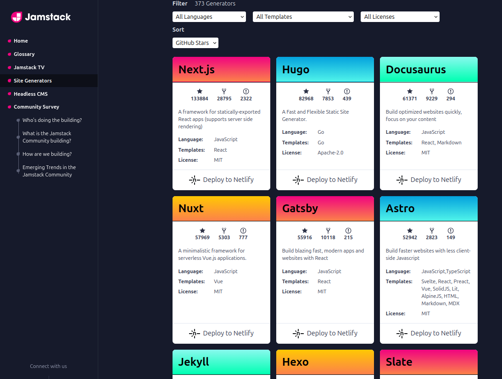
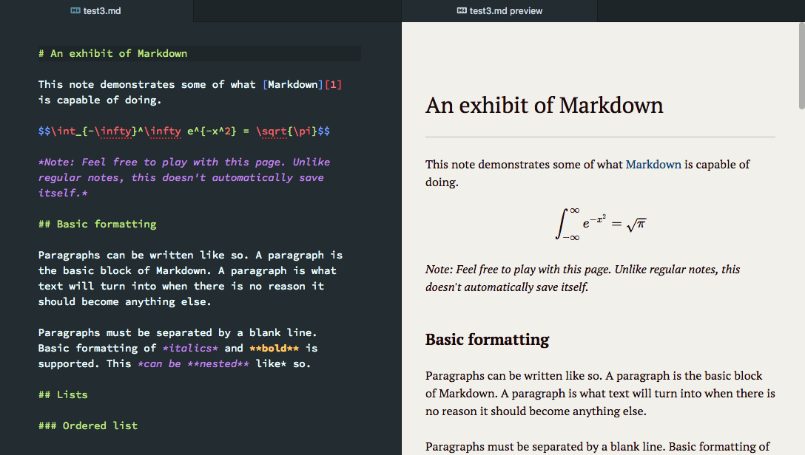
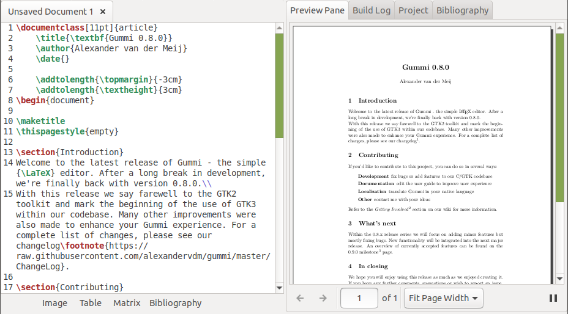
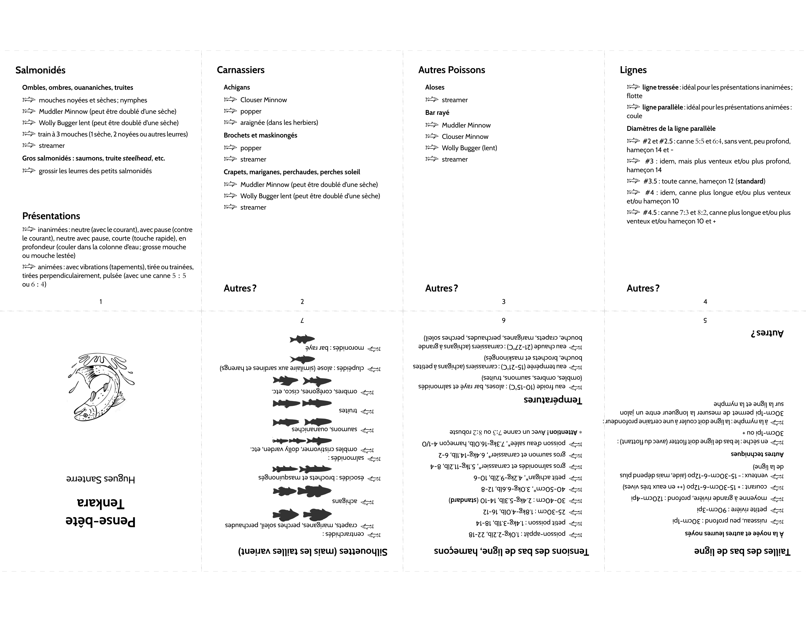
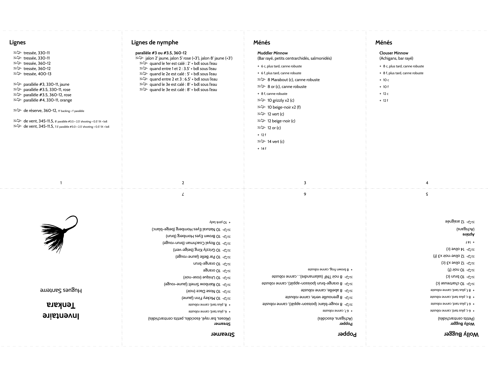

# LaTeX Pocket Book and Other Documents

Un complément au dépôt : **documentations_web_statiques**.

## Générateurs de sites web statiques

Une documentation avec un générateur de site web statique est rendue en HTML pour être hébergé en ligne. Avec la majorité des générateurs, la création du contenu (texte, images, liens, etc.) est faite en Markdown; un langage typographique qui simplifie le langage HTML.

Certains générateurs offrent l'option de publier en divers formats, dont le PDF. La conversion en PDF doit passer par une étape intermédiaire : une conversion du Markdown au LaTeX; un autre langage typographique.

## PDF

Pour différentes raisons -- limiter la diffusion, impression papier, lecture et annotation, etc. -- la documentation est produite directement en PDF.

### Éditeurs

GitHub fonctionne avec un éditeur Markdown intégré comme bien des services en ligne.

Les éditeurs Markdown proposent entre autres l'exportation en HTML, ePub et PDF. Cette catégorie regroupe les logiciels : Visual Studio Code, Typora, MarkText, Joplin, Ghostwriter, Zettlr et bien d'autres. Des logiciels spécialisés comme Jupyter Labs le font aussi.

Les traitements de texte facilent l'exportation en PDF. Cette catégorie regroupe les logiciels : WPS Office, Google Docs, OfficeSuite, MS Word, LibreOffice, FreeOffice et bien d'autres. 

### Éditeurs LaTeX

Un éditeur LaTeX est un outil complet pour écrire directement en LaTex, puis compiler en PDF. L'éditeur permet d'éditer toutes sortes de formats et de tailles d'impression papier.

Travailler directement en LaTeX ouvre les possibilités :

- Formats de document : articles, rapports, livres, CV, lettres, présentations et bien d'autres formats dans différentes tailles d'impression papier.
- Richesse d'édition : polices et tailles, caractères spéciaux et alphabets, listes, tableaux, boites et traits, compositions d'images, entêtes, bas de page, tables de matières, des figures, des tableaux, citations et bibliographies, index multiples, etc.
- Dessins vectoriels avec des modules : formules mathématique et chimiques, diagrammes, illustrations en géométrie, en chimie, en biologie, etc.,
    - Le LaTeX est compatible avec les images vectorielles obtenues avec des logiciels de dessins qui produisent des images PDF et/ou SVG qui se convertissent facilement en PDF. 

## Petit cas de figure LaTeX

Sans fournir un gros document comme un rapport ou un livre écrit en LaTeX, puis compilé en PDF, le projet <a href="https://pocketmod.com/" target="_blank">pocketmod</a> illustre les possibilités du LaTeX avec un petit template :

|   |   |   |
|---|---|---|
|   |   |   |

Voici des versions pour le tenkara (technique de pêche à la mouche japonaise) :

| pense-bête  | inventaire  |
|---|---|
|   |   |

## Mise en place et structure

1. Télécharger le projet LaTeX pocketmod d'une source.
    - https://github.com/liantze/pocketmod.sty
    - https://www.overleaf.com/latex/templates/creating-pocketmods-with-latex/nqbhpnrkskrx
    - https://www.overleaf.com/latex/examples/mini-livre-trigonometrie/ntgbdvthxhnb
1. Créer le répertoire de travail avec le fichier pocketmod.sty (le modèle pocketmod), les templates de départ, les images (vectorielles et matricielles).
1. Installer et ouvrir un éditeur LaTeX.
1. Démarrer un nouveau projet à partir à partir d'un template. Éditer son propre fichier avec ses images. Compiler. Expérimenter.
1. Imprimer et suivre le guide de pliage et de découpage sur <a href="https://pocketmod.com/" target="_blank">pocketmod</a> ou d'une des sources du module LaTeX pocketmod.
